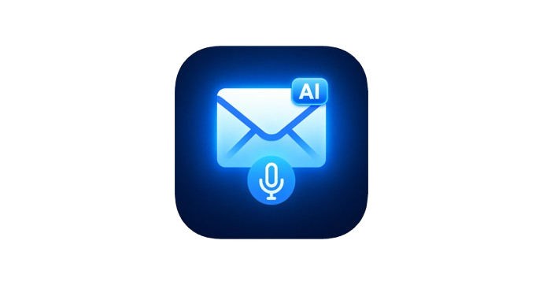

# 📧 Email Generator

Email Generator is a premium, AI-powered assistant designed to help you craft perfect emails in seconds. Whether you need a formal business proposal or a friendly check-in, our intelligent system ensures your tone and message are always on point.



## ✨ Features

- **AI-Powered Generation**: Leverages OpenAI's `gpt-4o-mini` to create context-aware emails.
- **Tone Customization**: Choose from 6 professional tones (Formal, Friendly, Assertive, Apologetic, Confident, Persuasive).
- **Key Points Integration**: Add specific points to ensure your email covers all necessary details.
- **Modern UI**: A stunning violet-themed dashboard built with React and Tailwind CSS.
- **Responsive Design**: Works perfectly on desktop and mobile devices.
- **Smart Fallback**: Includes a high-quality template system that works even if the API quota is reached.

## 🛠️ Tech Stack

- **Frontend**: [React](https://reactjs.org/) + [Vite](https://vitejs.dev/)
- **Language**: [TypeScript](https://www.typescriptlang.org/)
- **Styling**: [Tailwind CSS](https://tailwindcss.com/)
- **UI Components**: [shadcn/ui](https://ui.shadcn.com/)
- **AI Engine**: [OpenAI GPT-4o-mini](https://openai.com/)
- **Icons**: [Lucide React](https://lucide.dev/)

## 🚀 Getting Started

### Prerequisites

- Node.js (v18 or higher)
- npm or bun

### Installation

1.  **Clone the repository**:
    ```bash
    git clone https://github.com/Aderine2006/Email-Assistant.git
    cd Email-Assistant
    ```

2.  **Install dependencies**:
    ```bash
    npm install
    ```

3.  **Set up Environment Variables**:
    Create a `.env` file in the root directory and add your OpenAI API key:
    ```env
    VITE_OPEN_AI_KEY=your_openai_api_key_here
    ```

4.  **Run the development server**:
    ```bash
    npm run dev
    ```

5.  **Build for production**:
    ```bash
    npm run build
    ```

## 🎨 Design System

The project uses a custom-curated **Violet Design System**, providing a productivity-focused and premium aesthetic.
- **Colors**: Vibrant Violet primary, clean backgrounds, and subtle glassmorphism.
- **Typography**: Clean sans-serif fonts for maximum readability.

## 📄 License

This project is open-source and available for educational purposes.

---

*Crafted with ❤️ by Aderine*
